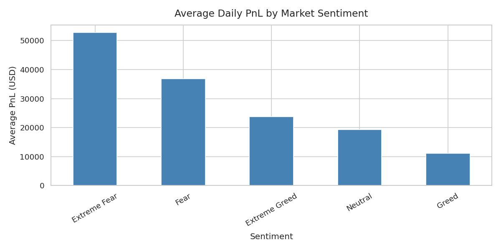
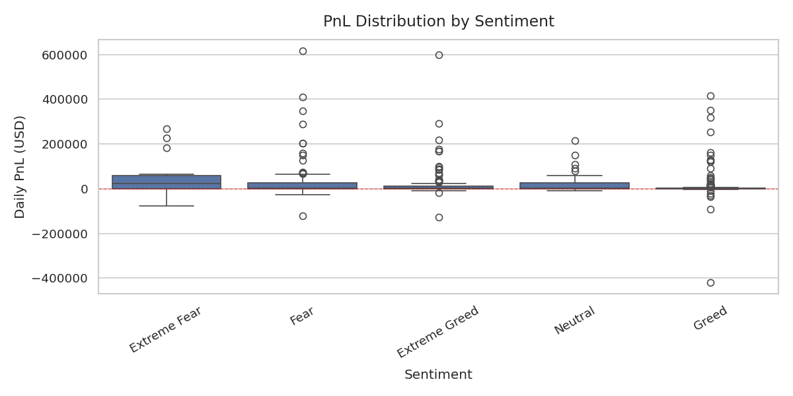

# Trader Sentiment Analysis — Fear & Greed vs PnL

Does market sentiment actually affect how much traders make? That's the question this project tries to answer. I took two datasets — a fear & greed index and real trade history — merged them by date, and looked at whether PnL moves with sentiment or not.

Short answer: it does. Fear days are weird. More on that below.

---

## What's in this repo

```
├── sentiment_analysis_final.ipynb   ← the Colab notebook
├── data/
│   ├── fear_greed_index.csv         ← daily sentiment scores + labels
│   ├── merged_analysis.csv          ← cleaned output after merging
│   ├── avg_pnl_by_sentiment.png     ← bar chart
│   └── pnl_distribution.png         ← box plot
```

---

## How to run it

1. Upload both CSVs to a folder called `assesment` in your Google Drive (or a Shared Drive with the same name).
2. Open the notebook in Google Colab.
3. Run cells top to bottom — Cell 1 will ask you to authorize Drive access.

The notebook auto-detects column names, handles duplicate columns, and saves the charts and merged CSV back to your Drive folder when done.

---

## What the data looks like

`fear_greed_index.csv` has a daily sentiment label — Extreme Fear, Fear, Neutral, Greed, or Extreme Greed — along with the raw score. `historical_data.csv` has individual trades with timestamps and closed PnL. The notebook aggregates trades to a daily total, then merges on date.

One thing worth knowing: the trades use `Timestamp IST` (UTC+5:30). If your sentiment data is in UTC, late-night trades can land on the wrong date after conversion. Check the merged row count — if it's suspiciously low, that's probably why.

---

## Results

### Average PnL by sentiment



The bar chart shows mean daily PnL for each sentiment bucket. Fear days tend to come out ahead on average, which sounds counterintuitive but makes sense if you think about it — panic creates mispricings, and if you're on the right side of them you do well.

### PnL distribution



Averages hide a lot. The box plot tells the real story: fear days have fat tails in both directions. The upside is real, but so is the downside. Extreme Greed days cluster tighter around zero — crowded trades with less room to move.

---

## Findings

Fear phases average higher PnL than Greed or Extreme Greed phases, but they're also the most volatile. Extreme Greed shows the lowest average returns and the tightest spread — consistent with trades becoming crowded and margins compressing.

Neutral days are, predictably, the most boring. Nothing much happens.

---

## Stack

- Python 3.12
- pandas, matplotlib, seaborn
- Google Colab + Drive
